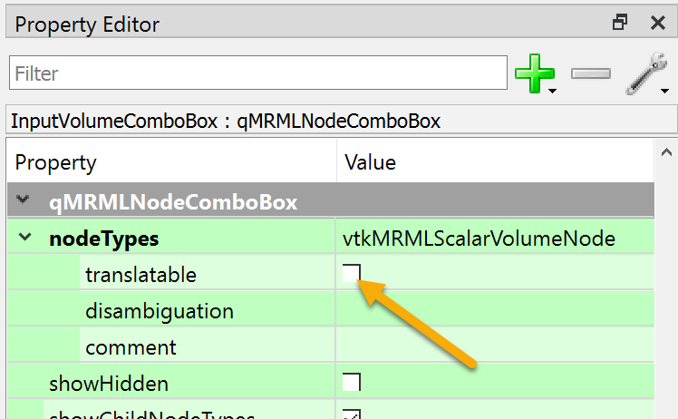

# Guide for Slicer module developers

These instructions are for Slicer module developers (in Slicer core or in Slicer extensions) who want to make their modules to be translatable.

## Preparing .ui files for translation

By default, most string and stringlist properties that appear in .ui files are made avaiable for translation. This is usually the correct behavior, but in some cases strings contain strings that must not be translated and must not appear in translation source (.ts) files.

Properties that **must be marked as non-translatable in Qt designer** by unchecking the `Translatable` option, unless they are set to their default value (typically empty):

- In node selector widgets, such as qMRMLNodeComboBox, qMRMLCheckableNodeComboBox, qMRMLSubjectHierarchyTreeView, qMRMLTreeView:
  - `nodeTypes`
  - `hideChildNodeTypes`
  - `interactionNodeSingletonTag` (if not the default "Singleton" value)
  - `sceneModelType`
  - `levelFilter`
- In MRML widgets (qMRML...Widget) that support quantities, such as qMRMLRangeWidget or qMRMLCoordinatesWidget:
  - `quantity`
- In widgets that save data into application settings, such as ctkPathLineEdit, qMRMLSegmentationFileExportWidget, qMRMLSegmentEditorWidget:
  - `settingKey`
  - `defaultTerminologyEntrySettingsKey`
- In widgets that save data into node or subject hierarchy attributes, such as qMRMLSubjectHierarchyComboBox, SubjectHierarchyTreeView:
  - `includeItemAttributeNamesFilter`
  - `excludeItemAttributeNamesFilter`
  - `includeNodeAttributeNamesFilter`
  - `excludeNodeAttributeNamesFilter`
- In slice view widgets, such as qMRMLSliceControllerWidget and qMRMLSliceWidget:
  - `sliceViewName`
  - `sliceOrientation`
- In qMRMLSegmentationConversionParametersWidget:
  - `targetRepresentationName`
- In qSlicerMouseModeToolBar:
  - `defaultPlaceClassName`



## Correctly using the translation function

Wherever your program uses a string litteral (quoted text) that will be displayed in the user interface, make sure to get it processed by the [*translation function*](https://doc.qt.io/qt-5/i18n-source-translation.html#using-tr-for-all-literal-text). In source codes, `tr()` is indeed used to mark translatable strings so that, at runtime, `Qt` may replace them by their translated version that corresponds to the display language.

In the translation process, it's very important to know how to correctly call `tr()` since it determines the context that will be associated with any string when it's about to translate it.

Therefore, in the Slicer internationalization process, we have retained some recommendations on how to correctly use the translation function. Such guideline is described in the following sections.

### How to use *tr()* in QObject classes

Within a class inheriting from QObject, whether this inheritance is direct or not, all that is necessary to do is to use the [tr()](https://doc.qt.io/qt-5/qobject.html#tr) function to obtain translated text for your classes.
```c++
LoginWidget::LoginWidget()
{
    QLabel *label = new QLabel(tr("Password:"));
    ...
}
````
Classes inheriting from QObject should add the [Q_OBJECT](https://doc.qt.io/qt-5/i18n-source-translation.html#defining-a-translation-context) macro in their definition so that the translation context is correctly handled by `Qt`.
```c++
class MainWindow : public QMainWindow
{
    Q_OBJECT

    public:
        MainWindow();
        ...
```

> **_NOTE:_**  To avoid errors with some build tools (e.g. cmake), it's recommanded to always declare classes with Q_OBJECT macro in the header file (.h), not in the implementation one (.cpp). If for any reason your QObject class must be declared in the .cpp file (**e.g.** low level implementation classes), we recommand not to add the Q_OBJECT macro to that class, but rather, to prefix all `tr()` calls with the associated public class as follows : `PublicClassName::tr("text to translate")`

### How to use *tr ()* in non-QObject classes

Non-QObject classes don't have a translation function, so directly calling `tr()` on them may result in errors.

A common practice is to prefix `tr()` calls on these classes with a Qt  core class like `QObject::tr()`, `QLabel::tr()`, etc. However, we don't recommend this approach since `lupdate` will associate such translatable strings with a context that is different from the class where they are located.
Therefore, when it's about to translate non-Qt classes, we recommand to provide translation support to the class by directly adding the [Q_DECLARE_TR_FUNCTIONS](https://doc.qt.io/qt-5/i18n-source-translation.html#translating-non-qt-classes) macro on it.
```c++
class MyClass
{
    Q_DECLARE_TR_FUNCTIONS(MyClass)

    public:
        MyClass();
        ...
};
```
Doing so will provide the class with `tr()` function that can be directly used to translate strings associated with the class, and makes it possible for `lupdate` to find translatable strings in the source code.

>**NOTE:** If for any reason the class name should not be exposed to other developers or translators (private classes, ...), we recommand to prefix `tr()` calls with the associated public class as follows :  `PublicClassName::tr("text to translate")`

### Translating keyboard shortcuts

According to [Qt recommendations](https://doc.qt.io/qt-6/qkeysequence.html#keyboard-layout-issues), keyboard shortcuts should be specified using translatable strings to be able to better accommodate different keyboard layouts commonly used for a specific language.

Examples:

```c++
this->RunFileAction->setShortcut(QKeySequence::Print);  // best option (if a standard key sequence is available)
this->RunFileAction->setShortcut(ctkConsole::tr("Ctrl+g"));  // preferred option, if a standard key sequence is not available
this->RunFileAction->setShortcut("Ctrl+g");  // do not use
this->RunFileAction->setShortcut(Qt::CTRL | Qt::Key_G);  // do not use
```

### Translating module title

Module title (the name that is visible in the module selector) is returned by the module class and it should be translated.

In older C++ loadable modules, the module name was set in CMakeLists.txt using a macro and was set in the module's header file using `QTMODULE_TITLE` precompiler definition. To make C++ loadable module title translatable (see example [here](https://github.com/Slicer/Slicer/pull/6828/commits/f4d771a6f1e6f501e67ae0f73123edcfdb1b9c5a)):
- Remove `set(MODULE_TITLE ${MODULE_NAME})` and `TITLE ${MODULE_TITLE}` lines from `CMakeLists.txt`
- Use `tr("qSlicerLoadableModuleTemplateModule")` in `qSlicerGetTitleMacro()` in the module header file

### Qt lupdate common warnings

If `tr()` calls are not correctly handled on the source code, some warnings may appear when running `lupdate`.

#### Cannot invoke tr() like this

Qt lupdate tool throws `Cannot invoke tr() like this` warnings when translation function is called using an object like `q->tr(...)`. The problem is that lupdate cannot determine the class name `tr()` is called on and therefore it does not know the translation context. 

This problem may be solved by spelling out the class name in the call, for example `qSlicerScalarVolumeDisplayWidget::tr(...)`, as described in the previous sections.

#### Class  _'SomeClassName'_  lacks Q_OBJECT macro

Qt lupdate tool throws `Class 'SomeClassName' lacks Q_OBJECT macro` warnings when translation function is called on a QObject class with no Q_OBJECT macro in its definition. The problem is also that `lupdate` cannot determine the class name `tr()` is called on and therefore it doesn't know the translation context.

The solution is to add the `Q_OBJECT` macro in the class where `tr()` is called, or, in case of classes that should not be exposed (private classes, low level implementation classes, ...), to prefix `tr()` calls with the associated public class, as described in the previous sections.

## Identifying translatable strings

In the translation process, only strings that are displayed at the user interface level should be considered. Thus, strings refering to module names, file contents, file extensions, developer communications such as log messages (e.g. `PrintSelf` or `qCritical` outputs ) or any developer-related content, should be considered as non translatable.

To make it clear that a string must not be translated, `/*no tr*/` comment can be added to a string to indicate that the `tr()` function is intentionally not used.

## Using common base classes for shared strings

To prevent duplication of source strings, a `tr()` method of a common base class should be used for the following strins:
- Module category names (`Informatics`, `Registration`, `Segmentation`, ...) should be translated using `qSlicerAbstractCoreModule::tr()`

## Using `lupdate` to extract translatable strings

To extract all translatable strings present on the Slicer source code, we can use the `Qt lupdate` tool. In `Qt 5.15.2`, which is used in the current Slicer version, `lupdate` can be found in `<QT_ROOT_FOLDER>/5.15.2/msvc2019_64/bin`. 

Thus, to obtain the translation file, we just have to run the following command :

`lupdate slicer_root_folder -ts translation_file.ts`

**NB :** `slicer_root_folder` should be replaced by the path to your Slicer root folder and `translation_file` is the name of the translation file (has `.ts` extension).
