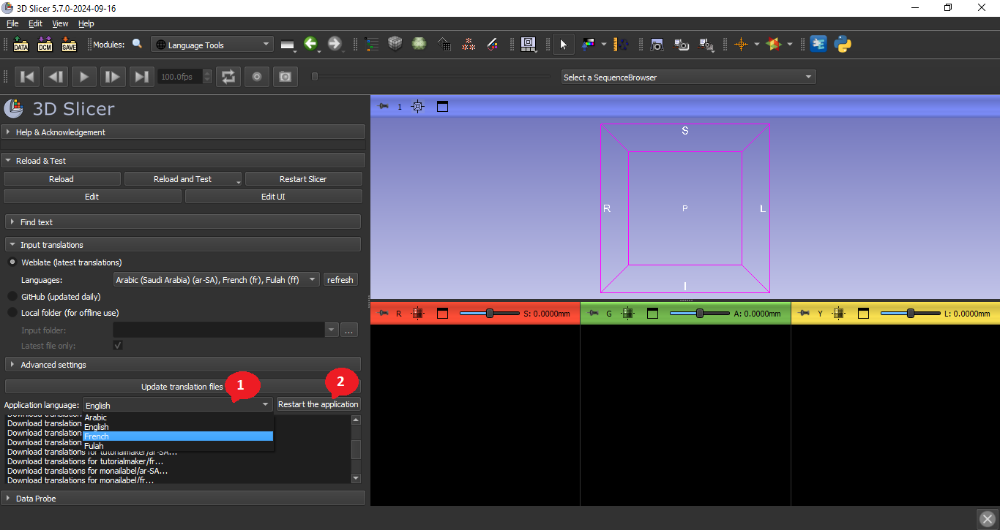

## How to use

### Setup

- [Download](https://download.slicer.org) and install a recent 3D Slicer Preview Release (released 2023-05-17 or later)
- Install SlicerLanguagePacks extension. 
  - `1` : Open the `extension manager`
  - `2` : Type LanguagePacks in the `search bar`
  - `3` : Click on `Install`
  - `4` : Click on `Restart`
  

### Download and install latest translations

- `1` : Download latest translation
  - Option A: `Weblate`. Download selected langauges directly from Weblate. This allows getting the most recent translations immediately, which is useful for translators wanting to test their translated application immediately.
  - Option B: `GitHub`. Download all languages from [SlicerLanguageTranslations](https://github.com/Slicer/SlicerLanguageTranslations) repository. This is the fastest way to get updated translation files for all languages, but these translations files are updated only once a day.
- `2` : Refresh Weblate language list by querying the weblate server by clicking `refresh` button.
- `3` : Select all language that will be downloaded and installed in the `languages`
- `4` : Compile the translation files and install them into the application by clicking `Update translation files` button.

### Set the language of the application

- Set the language of application in the `Application languge`
- Click `Restart the application` button to start using the new translation files in the user interface.

In order to understand more you can see an explanatory video [here](https://www.youtube.com/watch?v=pANAmbhl36o&t=10s).
