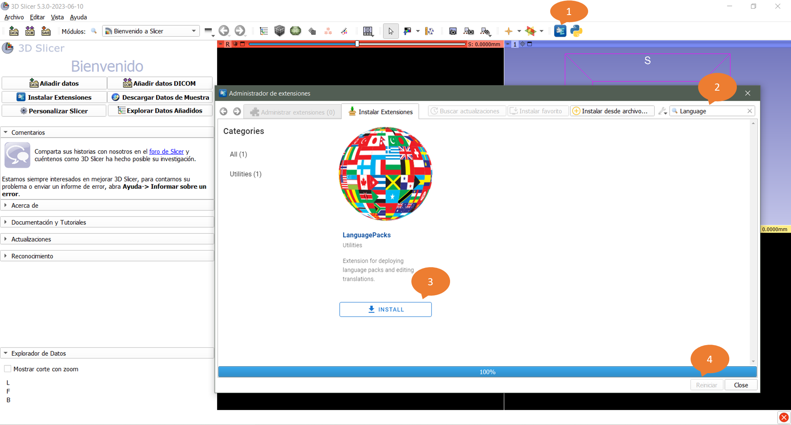
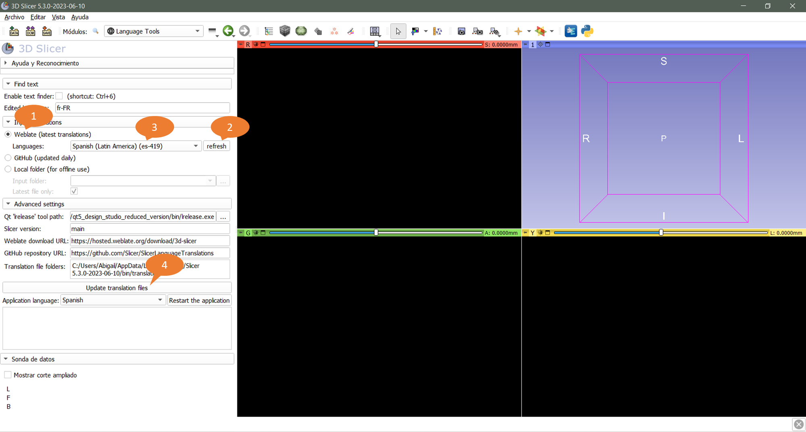
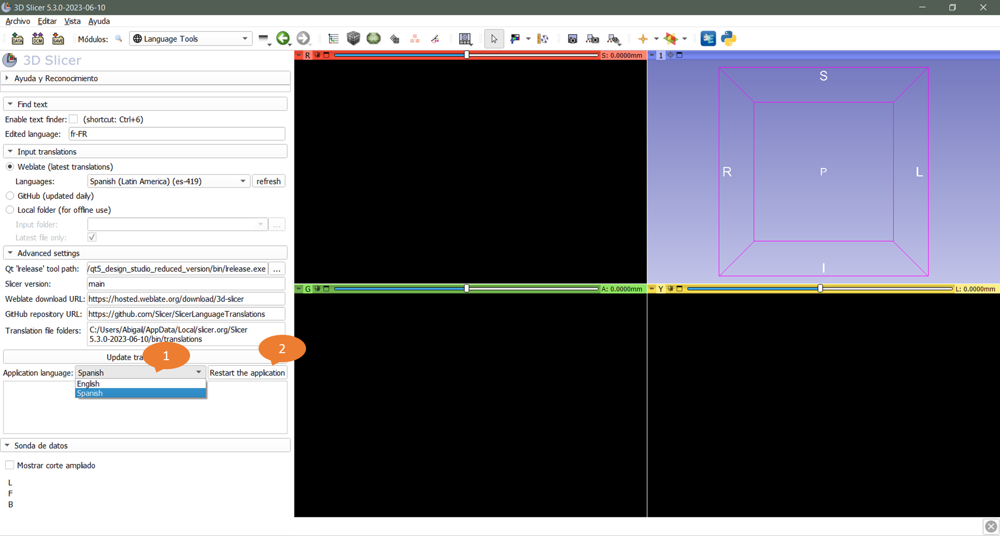

## Cómo se usa

### Configuración

- [Descargar](https://download.slicer.org) e instalar una versión preliminar reciente de 3D Slicer (publicada a partir del 17-05-2023)
- Instalar la extensión de SlicerLanguagePacks.
  - `1` : Abrir el `administrador de extensiones`
  - `2` : Escriba LanguagePacks en la `barra de búsqueda`
  - `3` : Haga clic en `Instalar`
  - `4` : Haga clic en  `Reiniciar`
  

### Descargar e instalar las últimas traducciones

- `1` : Descargar la última traducción
  - Opción A: `Weblate`. Descargar los idiomas seleccionados directamente de Weblate. Esto permite obtener enseguida las traducciones más recientes, que resulta útil para los traductores que desean probar inmediatamente su aplicación traducida.
  - Opción B: `GitHub`. Descarga todos los idiomas del repositorio [SlicerLanguageTranslations](https://github.com/Slicer/SlicerLanguageTranslations). Esta es la forma más rápida de obtener archivos de traducción actualizados para todos los idiomas, pero estos archivos de traducción sólo se actualizan una vez al día.
- `2` : Actualice la lista de idiomas haciendo clic en el botón `actualizar` para consultar el servidor Weblate.
- `3` : Seleccione los idiomas que se instalarán en el campo `idiomas`.
- `4` : Compila los archivos de traducción e instálalos en la aplicación pulsando el botón `Actualizar archivos de traducción`.

### Establecer el idioma de la aplicación

- Establezca el idioma de la aplicación en el campo `idioma de la aplicación`
- Pulse el botón `Reiniciar la aplicación` para empezar a utilizar los nuevos archivos de traducción en la interfaz de usuario.

Hay disponible un tutorial en video de los diferentes pasos [aquí](https://www.youtube.com/watch?v=pANAmbhl36o&t=10s).
