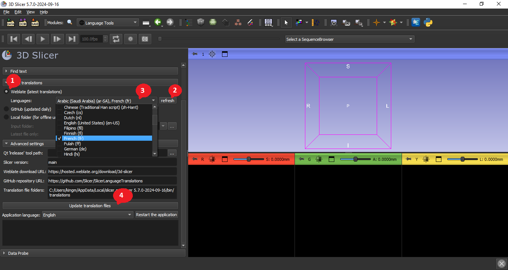

## Como Usar

### Configuração

- [Baixe](https://download.slicer.org) e instale uma versão de prévia recente do *3D Slicer* (liberada em 17/05/2023 ou depois)
- Instale a extensão "SlicerLanguagePacks". 
  - `1` : Abra o `gerenciador de extensões`
  - `2` : Digite "LanguagePacks" na `barra de pesquisa`
  - `3` : Clique em `Install`
  - `4` : Clique em `Restart`
  

### Baixe e instale as traduções mais recentes

- `1` : Baixe as traduções mais recentes
  - Opção A: `Weblate`. Baixe as linguagens selecionadas direto do *Weblate* do *Slicer*. Isso permite obter as traduções mais recentes, o que é útil para tradutores que desejam testar o aplicativo traduzido imediatamente.
  - Opção B: `GitHub`. Baixe todas as linguagens do repositório [SlicerLanguageTranslations](https://github.com/Slicer/SlicerLanguageTranslations). Essa é a maneira mais rápida de obter arquivos de tradução atualizados para todos os idiomas, mas esses arquivos de tradução são atualizados apenas uma vez por dia.
- `2` : Atualize a lista de linguagens clicando no botão `refresh`, realizando uma consulta ao servidor do *Weblate*.
- `3` : Selecione as linguagens que serão instaladas no campo `languages`
- `4` : Compile os arquivos de tradução e instale-os no aplicativo clicando no botão `Update translation files`.

### Definir o idioma do aplicativo

- Defina o idioma do aplicativo no campo `Application language`.
- Clique no botão `Restart the application` para começar a usar os novos arquivos de tradução na interface do usuário.

Um tutorial em vídeo das diferentes etapas está disponível [aqui](https://www.youtube.com/watch?v=FqjhtJwRMKE).
