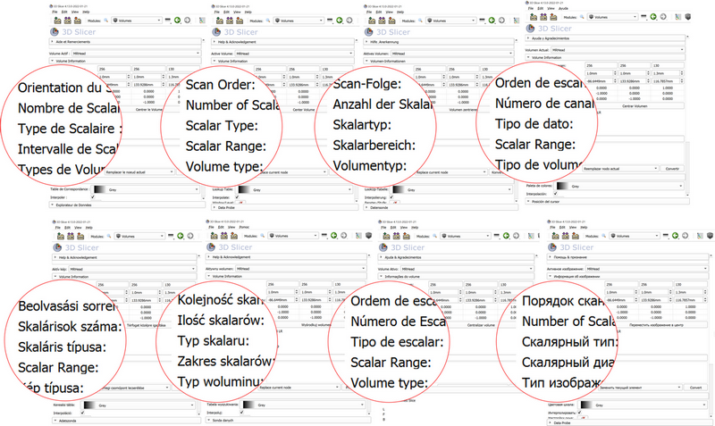
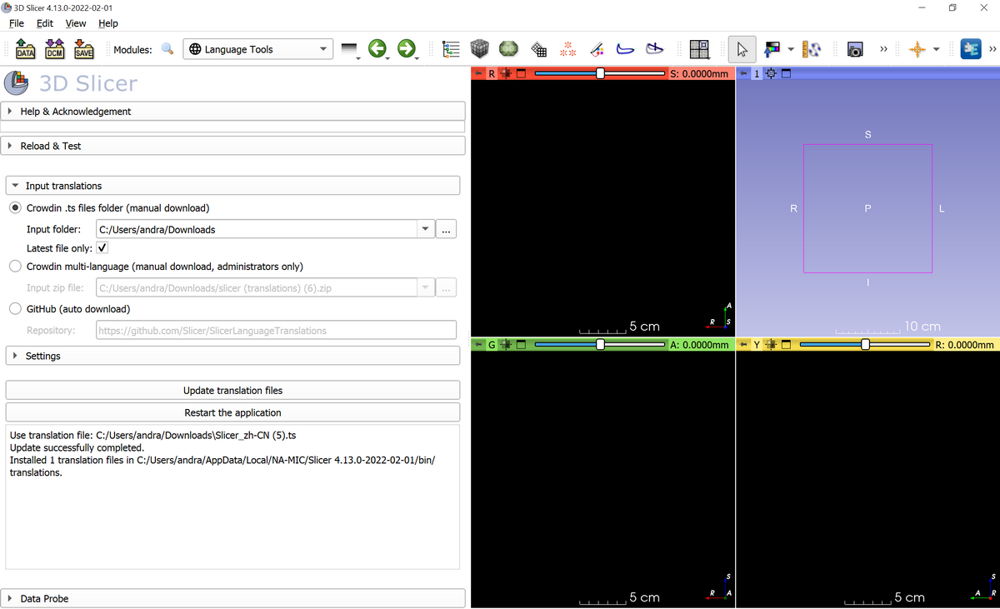
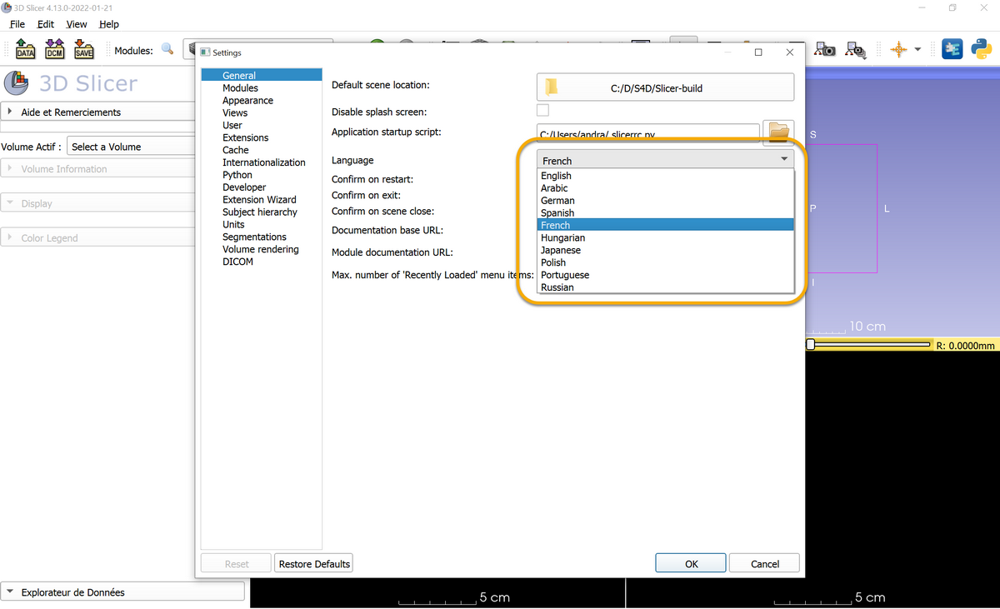

# SlicerLanguagePacks extension

3D Slicer extension for creating, editing, and storing translations for Slicer core and extensions.

## How to use

### Setup

- Install Qt toolkit. It is free. Go to [Qt website](https://www.qt.io/download-open-source), scroll down, click `Download the Qt online installer` button, and follow the instructions. Any Qt version can be used.
  - Qt is required because it contains the `lrelease` tool, which can compile a human-readable translation file(.ts file, that are edited in Crowdin) to a binary file (.qm file, that the application can use).
  - The Qt company added many misleading statements on its website to try to trick users into buying a commercial license of Qt with. A commercial license is not needed, even for commercial uses of Qt. The free, open-source version is sufficient.
- Install a recent Slicer Preview Release and install SlicerLanguagePacks extension.
- In Slicer, go to `Language Tools` module and set `Qt lrelease tool path`. It is located in the folder where Qt was installed.
  - Default location on Windows is something like this: `c:\Qt\5.15.0\msvc2019_64\bin\lrelease.exe`

### Download and install latest translations

- Download latest translation
  - Option A: download automatically from [SlicerLanguageTranslations](https://github.com/Slicer/SlicerLanguageTranslations). This is the easiest way to get updated translation files, but these translations files are updated only once a day.
    - Select `Github` option in `Input translations` section.
  - Option B: manual download from crowdin
    - Open [Slicer project in crowdin.com](https://crowdin.com/project/slicer)
    - Click `Build & Download` button. It downloads a zip file within about a minute.
    - Select `Crowdin` option in `Input translations` section.
    - Set the zip file path in `Input zip file` in `Input translations` section.
- Compile the translation files and install them into the application by clicking `Update translation files` button.
- Click `Restart the application` button to start using the new translation files.

### Set application language

Language can be selected in menu: Edit -> Application Settings, General section -> Language. The application has to be restarted after changing language.

