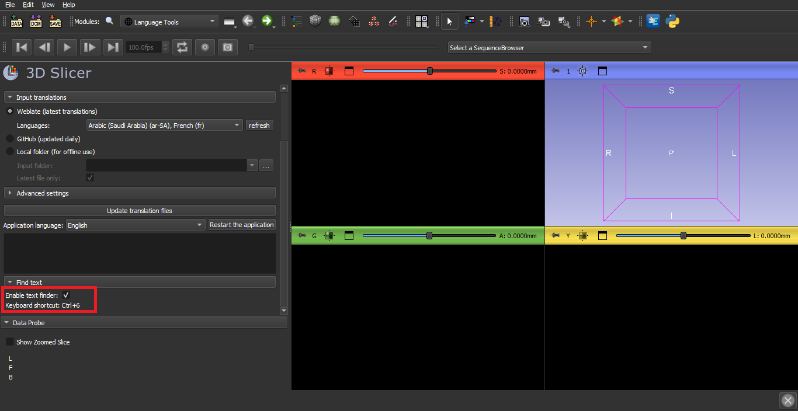

# Translation Guidelines

The goal of this document is to provide new contributors to the community based translation of 3D Slicer on [Weblate](https://hosted.weblate.org/projects/3d-slicer/3d-slicer/) with tips on how to easily and accurately help translating the interface of the software.

This document is a work in progress. Feel free to suggest changes via [GitHub "pull request"](https://docs.github.com/en/repositories/working-with-files/managing-files/editing-files).

## 1. Get Started on Weblate

Weblate is a collaborative translation tool for open source projects. With the help of our wonderful contributors, we are working towards a full translation of the 3D Slicer interface, through a mainly community based effort. Thank you for joining us!

You can find a video tutorial on how to create a Weblate account [here](https://youtu.be/LSvc9MmrxPA)

If you create an account using your email and a username, you will receive a confirmation email. Open the link it contains, and follow the instructions.

It is preferable to use your GitHub account to access Weblate. This will allow Weblate to automatically synchronize your projects with the associated GitHub repository.

If you sign in using GitHub, you will be redirected to a GitHub page where you will be asked to confirm granting Weblate access to your GitHub account. 

[Here](https://github.com/Slicer/SlicerLanguagePacks/blob/main/HowToUse.md) is a link to a tutorial on how to install and set up the Slicer Language Pack to enable other languages in the app.

**Note:** Be sure to repeat the `Update translation files` and `Restart the application` steps every now and then to have the latest and most complete translations, as new terms may have been translated since you last used Slicer.

## 2. Locating a string on the Slicer Graphic User Interface (GUI)

A specific string can have many different occurrences on the Slicer GUI, sometimes even in the same module.  The position and function of an element on the interface can affect its meaning and by extension, its translation. It is therefore helpful to know these few tips to identify exactly which element of the interface you are translating on Weblate at a given moment.

### The "key" indicator
In the upper right corner of the translation on Weblate, you will notice the word `Key` in bold, followed by a string. That string can help you know approximately (sometimes exactly)  in which module or window of the GUI, the term you are translating is located, as illustrated below.

### Search for untranslated strings

It may be advisable to start translation of strings with the main application user interface. To achieve this, enter search term that excludes strings in CLI (command-line interface modules) modules: `NOT state:translated AND NOT (key:"CLI_")`

### Nearby strings
As mentioned above, you may have multiple occurrences of a term in the same module’s interface. In that case, it can be useful to rely on the elements surrounding the one you are translating. Weblate pairs each string with a list of strings that are directly before or after the element in the GUI code.

### "Source string location"
The `source string location` tag on Weblate can help you go one level further and find exactly **which line of code contains the string** you are currently translating. It can be found in the `String Information` box on the lower right.

*(the reason the line numbers do not match in this specific example is that the code has been updated in between when the translation files were uploaded and now)*

## 3. Translation of text

### Placeholders and special characters

Source text is mostly plain text, but there are some special characters and conventions that common Qt and Python translation tools use. A short summary:

- Placeholders are used for text that is replaced by specific names or numbers when the application is used. Placeholders can appear as `%1`, `%2`, ... (Qt-style) or as `{some_name}`, `{some_number}` (Python-style) in the source text. Placeholders must not be translated but kept unchanged in the translated text.
- Keyboard shortcuts are designated by the `&` prefix within a string (Qt-style). For example `&New file` will make the letter `N` a keyboard shortcut. Keyboard shortcuts are recommended to be preserved. Since single `&` character designates a keyboard shortcut, `&&` must be used to place ampersand character in the text.

Examples:

- Source text: `The {name} module could not be registered`
  - Good translation: `A {name} modult nen lehetett regisztralni`
  - Bad translation: `A {nev} modult nen lehetett regisztralni` (`name` placeholder was modified to `nev`)
- Source text: `Node %1 is exported successfully to %2`
  - Good translation: `%1 elemet sikeresen mentettuk %2 helyre`
  - Good translation: `Elmentettuk %2 helyre %1 elemet` (order of placholders can be changed in the translated text)
  - Bad translation: `%1 elemet sikeresen mentettuk` (`%2` placeholder is missing)
- Source text: `Create &New File`
  - Good translation: `Keszitsen &Uj Fajlt`
  - Bad translation: `Keszitsen Uj Fajlt` (works, but keyboard shortcut is no longer available for this button or menu item)
- Source text: `Help && Acknowledgement`
  - Good translation: `Segitseg && Koszonetnyilvanitas`
  - Good translation: `Segitseg es Koszonetnyilvanitas` (not necessary to use ampersand if it is not commonly used in the target language)
  - Bad translation: `Segitseg & Koszonetnyilvanitas` (single ampersand will be interpreted as a keyboard shortcut)

### Translation of difficult terms

On the complex interface of 3D Slicer, certain terms can have very context-specific meanings that are likely to lose their accuracy if not translated carefully. Locating the string on the interface or using the element it designates can help understanding better the exact definition of the term and therefore translating it as accurately as possible.
Another way to ensure the highest quality of translation is to take advantage of the community based approach that our internationalization process is based on.

#### The `Suggest` button
When translating a string on Weblate, you have the option to submit your translation and move to the next item, submit your translation and stay on the same page or to submit your translation as a suggestion.

 

 When you choose to do the latter, the difference between your translation and the current one are highlighted in green and the parts they replace are striked through and highlighted in red as illustrated below.
 
 

The suggestion can then be approved or edited or discarded by yourself or another user or an assigned proofreader.

 

This option is useful in case you are unsure of the translation you submitted and you would like to take the time to understand the term better before confirming it or you would like to get a second opinion from other users.

#### The comments section
Weblate also offers the possibility to leave a comment on a string’s translation page. This allows you to engage with other contributors in your language and start a conversation about the understanding each of you have of the term and eventually agree on a common meaning and translation.

 

To make sure you stay engaged in the discussions related to the project, you can update your settings to be notified when a new comment is posted; and in case the notifications become overwhelming, you can always adjust them to fit you.
e.g.: while an assigned proofreader would have to be notified of all the discussion updates, you can choose to set up Weblate to notify you only for comments related to translations you have submitted or the ones in which you are mentioned.

 

You can change your notification settings [here](https://hosted.weblate.org/accounts/profile/#notifications).

#### Untranslatable strings
Any string starting containing `vtk` or  `MRML` should not be translated and should be reported as bugs in Slicer bug reports. 

**Example:**

You may also tag them with the `read-only` flag (read more about Weblate flags [here](https://docs.weblate.org/en/latest/admin/checks.html#customizing-behavior-using-flags))

## 4. Validation of translation

There are several ways to indicate that a translation needs to be reviewed. The most commonly used by our contributors are the `needs editing` checkbox and the `suggest` feature.  

## 5. Style

For consistent style, it is important for all translators for a specific language use the same guidelines. Detailed Style Guide for most languages are available on [Microsoft's website](https://www.microsoft.com/en-us/language/StyleGuides). If translators agree in using a style guide then they only need to provide a download link to that style guide and document any differences they wish to make to those guidelines.

## 6. Glossary terms

Some English words are used in Slicer with a very specific meaning. For example `volume` refers to a 3D image.
Some of these words are listed in the [Slicer Glossary].(https://slicer.readthedocs.io/en/latest/user_guide/getting_started.html#glossary).

When translating these words to another language, it often makes sense to not translate these words directly,
but find a word that better describes the actual meaning, and translate that word. For example, instead of translating
`volume`, it makes more sense to translate the word `image` instead.

If you encounter a word that seems to make sense to translate based on a different English word, please add it to the Glossary on weblate
by clicking on the `Add term to glossary` link on the right side of the screen and describe what word was used by adding to the explanation: `Translate as "something"`.
See for example the `glyph` term: https://hosted.weblate.org/translate/3d-slicer/glossary/en/?checksum=d948d4a61ccd080a

Each project on Weblate has a **glossary** associated with it. It is a collection of terms, usually complex in meaning or very specific to the project scope, therefore requiring an extensive definition and sometimes extra precisions about the meaning and use of the string. The items listed in the glossary are then linked to the strings that contain them, in the main translation component (when a string contains a glossary term, there will be a reference to the term on the right of the interface in a panel labeled `Glossary`). This can be helpful in translating more or less difficult terms from the interface.

The `Glossary` panel will contain no information in the case of a term or string that is not in the glossary. However, if the term is referenced in the glossary, you will have a suggested `translation` as well as the `explanation` of the term. You can rely on the latter to make sure you have a better understanding of the term and therefore provide the most accurate translation possible.

Note that the `explanation` is only available in English. 

To find good translation for generic computing terms, you can use [Microsoft's terminology search function](https://www.microsoft.com/en-us/language/Search).

## 7. Find Text tool of the Language Packs Extension
 
 To use the `Find text` feature follow the following workflow :
 
  - `1` : Select `Enable text finder` in the Find text section of the Language Packs extension and select the French language.
  
  
  
  - `2` :  Navigate to Slicer module and press `Ctrl+6` or `Ctrl+Shift+6` for `Windows` and `Command+6` for `Mac` to activate the `Enable text finder` option.
  
  
  
  - `3` : Click on `Add DICOM Data` to locate the string in the Slicer Weblate repository.
  - `4` : Select `exact match`
  
  
  
  - `5` : The link will take you to the location of the strings in the Slicer Weblate repository. 
  

For more explanation, you can watch a pratical video [here](https://www.youtube.com/watch?v=npb4bBE-9cY)
