# Directives pour la traduction de 3D Slicer

L'objectif de ce document est de fournir des conseils aux nouveaux contributeurs à la traduction communautaire de 3D Slicer sur [Weblate](https://hosted.weblate.org/projects/3d-slicer/3d-slicer/) sur la manière d'aider facilement et précisément à traduire l'interface du logiciel.

## 1. Démarrez sur Weblate

Weblate est un outil de traduction collaborative pour les projets open source. Avec l'aide de nos merveilleux contributeurs, nous travaillons à une traduction complète de l'interface de 3D Slicer, grâce à un effort principalement communautaire. Merci de vous joindre à nous !

Vous pouvez trouver un tutoriel vidéo sur la façon de créer un compte Weblate [ici](https://www.youtube.com/watch?v=uF50VclvTt4).

Si vous créez un compte en utilisant votre e-mail et un nom d'utilisateur, vous recevrez un e-mail de confirmation. Ouvrez le lien qu'il contient et suivez les instructions.

Il est préférable d'utiliser votre compte GitHub pour accéder à Weblate. Cela permettra à Weblate de synchroniser automatiquement vos projets avec le dépôt GitHub associé.

Si vous vous inscrivez en utilisant GitHub, vous serez redirigé vers une page GitHub où il vous sera demandé de confirmer l'octroi à Weblate d'un accès à votre compte GitHub. 

[Voici](https://github.com/Slicer/SlicerLanguagePacks/blob/main/HowToUse_fr.md) un lien vers un tutoriel sur la façon d'installer et de configurer le Slicer Language Pack pour activer d'autres langues dans l'application.

**Remarque** : veillez à répéter les étapes: `Mettre à jour les fichiers de traduction`  et `redémarrer l'application` de temps à autre pour disposer des traductions les plus récentes et les plus complètes, car de nouveaux termes peuvent avoir été traduits depuis votre dernière utilisation de Slicer.

## 2. Localisation d'une chaîne de caractères sur l'interface utilisateur graphique (GUI) du Slicer

Une chaîne spécifique peut avoir de nombreuses occurrences différentes sur l'interface graphique de Slicer, parfois même dans le même module.  La position et la fonction d'un élément sur l'interface peuvent affecter sa signification et, par extension, sa traduction. Il est donc utile de connaître ces quelques conseils pour identifier exactement l'élément de l'interface que vous traduisez sur Weblate à un moment donné.

### L'indicateur “Clé”

Dans le coin supérieur droit de la traduction sur Weblate, vous remarquerez le mot `Clé` en gras, suivi d'une chaîne de caractères. Cette chaîne peut vous aider à savoir approximativement (parfois exactement) dans quel module ou fenêtre de l'interface graphique se trouve le terme que vous traduisez, comme illustré ci-dessous.

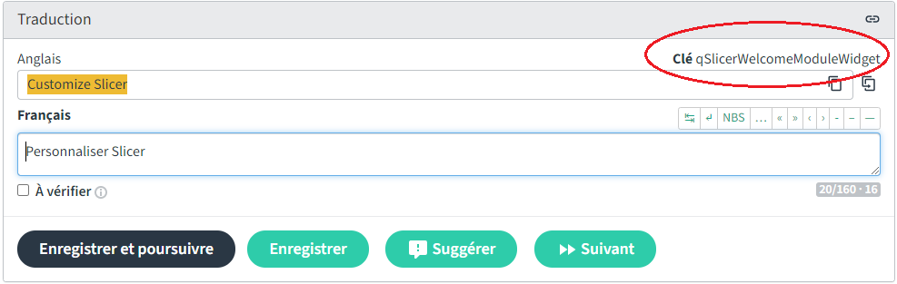

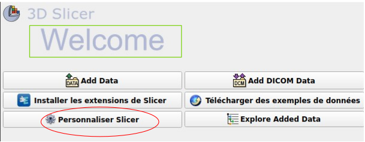

###  Chaînes à proximité

Comme mentionné ci-dessus, il se peut que vous ayez plusieurs occurrences d'un terme dans l'interface d'un même module. Dans ce cas, il peut être utile de s'appuyer sur les éléments qui entourent celui que vous traduisez. Weblate associe chaque chaîne de caractères à une liste de chaînes de caractères qui se trouvent directement avant ou après l'élément dans le code de l'interface graphique.

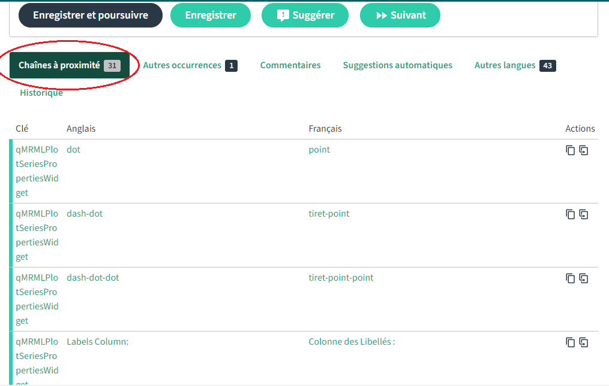

### "Emplacement de la chaîne source"

La balise `source string location` de Weblate peut vous aider à aller un peu plus loin et à trouver exactement la ligne de code qui contient la chaîne que vous êtes en train de traduire. Elle se trouve dans la case `String Information` en bas à droite.

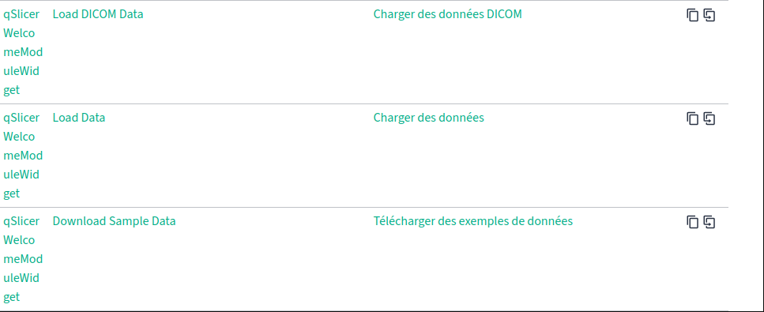

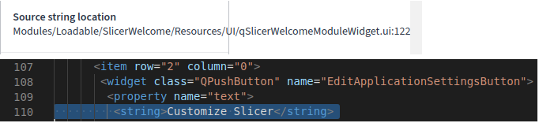

*(la raison pour laquelle les numéros de ligne ne correspondent pas dans cet exemple spécifique est que le code a été mis à jour entre le moment où les fichiers de traduction ont été téléchargés et maintenant)*

## 3. Traduction de termes difficiles

Sur l'interface complexe de 3D Slicer, certains termes peuvent avoir des significations très spécifiques au contexte et risquent de perdre de leur précision s'ils ne sont pas traduits avec soin. Repérer la chaîne de caractères sur l'interface ou utiliser l'élément qu'elle désigne peut aider à mieux comprendre la définition exacte du terme et donc à le traduire le plus précisément possible.
Une autre façon de garantir la meilleure qualité de traduction est de tirer parti de l'approche communautaire sur laquelle repose notre processus d'internationalisation.

### Le bouton `Suggérer`

Lorsque vous traduisez une chaîne de caractères sur Weblate, vous avez la possibilité de soumettre votre traduction et de passer à l'élément suivant, de soumettre votre traduction et de rester sur la même page ou de soumettre votre traduction en tant que suggestion.

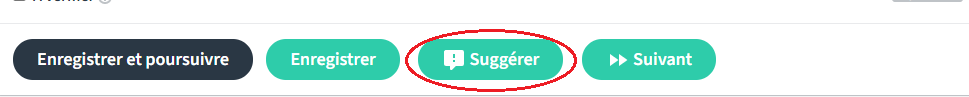

 Lorsque vous choisissez cette dernière option, les différences entre votre traduction et la traduction actuelle sont mises en évidence en vert et les parties qu'elles remplacent sont barrées et mises en évidence en rouge, comme illustré ci-dessous.

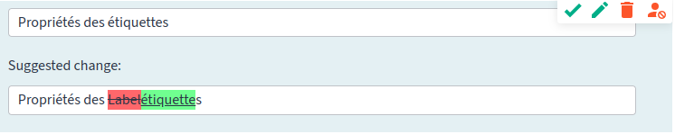

 La suggestion peut ensuite être approuvée, modifiée ou rejetée par vous-même, un autre utilisateur ou un correcteur désigné.

 Cette option est utile dans le cas où vous n'êtes pas sûr de la traduction que vous avez soumise et que vous souhaitez prendre le temps de mieux comprendre le terme avant de le confirmer ou que vous souhaitez obtenir un deuxième avis d'autres utilisateurs.

### La section des commentaires

Weblate offre également la possibilité de laisser un commentaire sur la page de traduction d'une chaîne de caractères. Cela vous permet de dialoguer avec d'autres contributeurs dans votre langue et d'entamer une conversation sur la compréhension que chacun d'entre vous a du terme et, éventuellement, de vous mettre d'accord sur une signification et une traduction communes.

Pour vous assurer que vous restez impliqué dans les discussions liées au projet, vous pouvez mettre à jour vos paramètres afin d'être averti lorsqu'un nouveau commentaire est posté ; et si les notifications deviennent trop nombreuses, vous pouvez toujours les ajuster à votre convenance.
Par exemple : alors qu'un correcteur désigné devrait être informé de toutes les mises à jour des discussions, vous pouvez choisir de configurer Weblate pour qu'il vous notifie uniquement les commentaires relatifs aux traductions que vous avez soumises ou à celles dans lesquelles vous êtes mentionné.

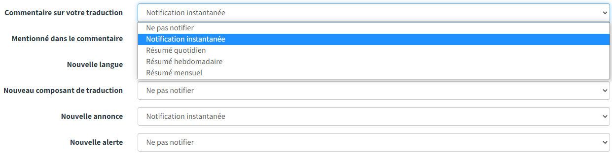

Vous pouvez modifier vos paramètres de notification [ici](https://hosted.weblate.org/accounts/profile/#notifications).

### Chaînes de caractères intraduisibles

Toute chaîne commençant par `vtk` ou contenant `MRML` ne doit pas être traduite et doit être signalée comme un bogue dans les rapports de bogue de Slicer.

**Exemple :**

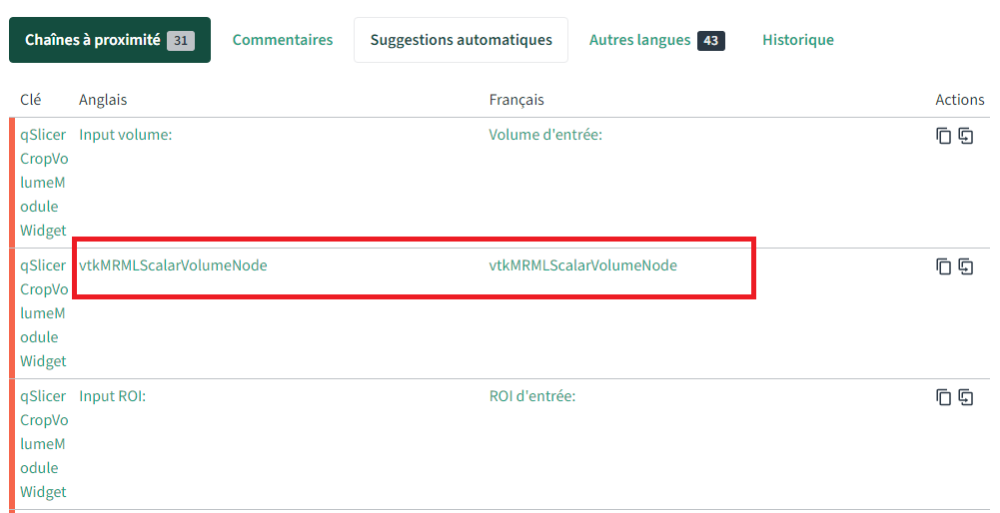

Vous pouvez également les marquer avec le drapeau `read-only` (pour en savoir plus sur les drapeaux Weblate, cliquez [ici](https://docs.weblate.org/en/latest/admin/checks.html#customizing-behavior-using-flags)).

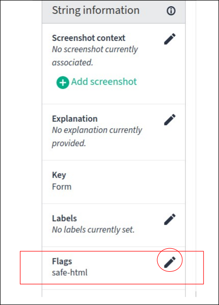

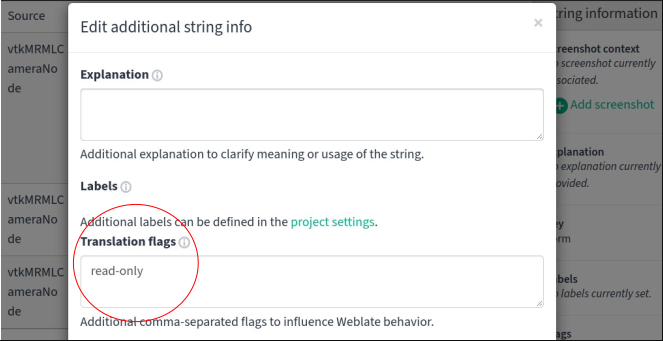

## 4. Validation de la traduction

Il existe plusieurs façons d'indiquer qu'une traduction doit être révisée. Les plus couramment utilisées par nos contributeurs sont la case à cocher `à vérifier` et la fonction `suggérer`.

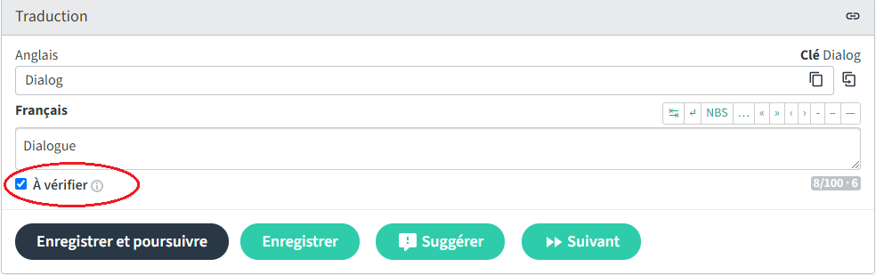

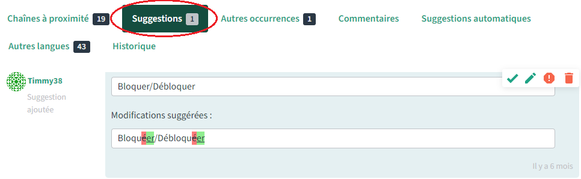

## 5. Style

In French, use sentence case, i.e., do not capitalize every word of a sentence. This applies everywhere, including button text, window title, etc. Rationale: Title case is not common in French. macOS operating system (which uses title case heavily in English) and Microsoft Office software use sentence case in French localized versions.

Le document de localization de Microsoft en français est disponible sur [ce lien.](https://github.com/Slicer/SlicerLanguagePacks/releases/download/TranslationResources/fra-fra-Style.Guide.pdf)

## 6. Termes du glossaire

Chaque projet sur Weblate est associé à un **glossaire**. Les éléments répertoriés dans le glossaire sont ensuite liés aux chaînes de caractères qui les contiennent, dans le composant principal de traduction (lorsqu'une chaîne de caractères contient un terme du glossaire, il y aura une référence à ce terme sur la droite de l'interface dans un panneau intitulé `Glossaire`). Cela peut être utile pour traduire des termes plus ou moins difficiles à partir de l'interface.

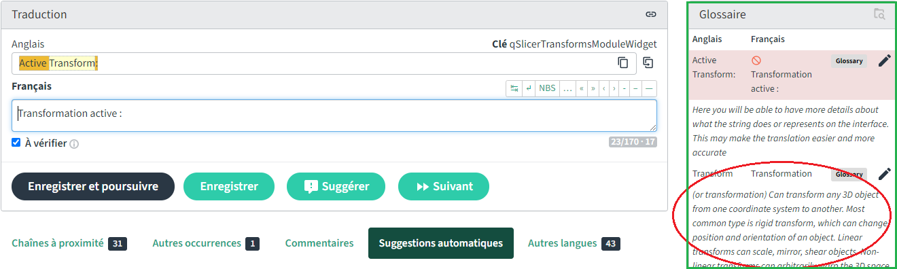

Le panneau `Glossaire` ne contiendra aucune information dans le cas d'un terme ou d'une chaîne qui ne figure pas dans le glossaire. En revanche, si le terme est référencé dans le glossaire, vous aurez une proposition de `traduction` ainsi que `l'explication` du terme. Vous pouvez vous fier à cette dernière pour vous assurer que vous comprenez mieux le terme et donc fournir la traduction la plus précise possible.

Notez que `l'explication` n'est disponible qu'en anglais.

## 7. Find Text
Pour utiliser la fonctionnalité `Find text` de l'extension `Language Packs`, suivez le flux de travail suivant :

  - `1` : L'utilisateur sélectionne `Enable text finder` dans la section Rechercher du texte et sélectionne la langue française.
  
  
  
  
  - `2` : L'utilisateur accède au module d'accueil de Slicer et appuie sur `Ctrl+6` ou sur `Ctrl+shift+6` pour activer l'option `Enable text finder`.
  
  
  
  
  - `3` : L'utilisateur clique sur `Télécharger des examples de données` pour identifier l'emplacement du texte sur Weblate.
  - `4` : L'utilisateur sélectionne `exact match`.
 
  

 - `5` : Le lien vous amènera à l'emplacement des `strings` dans le `Slicer Weblate repository`.
 
 

Pour plus d'explication, vous pouvez regarder une vidéo pratique [ici](https://youtu.be/BjOwI3B_IdE)
