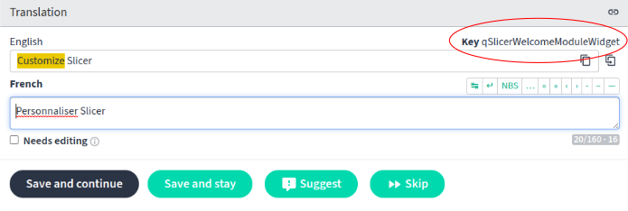
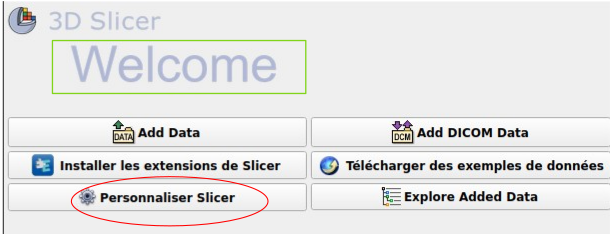
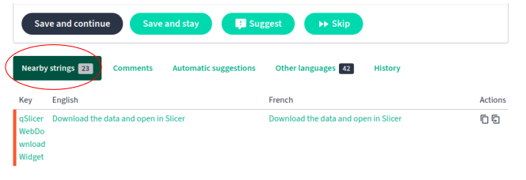
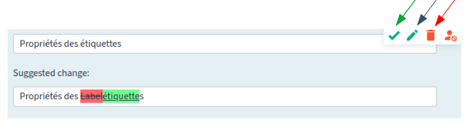
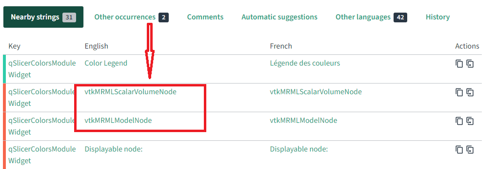

# Guia de Tradução

O objetivo deste documento é fornecer aos novos colaboradores da tradução baseada na comunidade do 3D Slicer no [Weblate] (https://hosted.weblate.org/projects/3d-slicer/3d-slicer/) dicas sobre como ajudar a traduzir a interface do software com facilidade e precisão.

Este documento é um trabalho em andamento. Sinta-se à vontade para sugerir alterações via [GitHub "pull request"](https://docs.github.com/en/repositories/working-with-files/managing-files/editing-files).

## 1. Comece a usar o Weblate

O Weblate é uma ferramenta de tradução colaborativa para projetos de código aberto. Com a ajuda de nossos maravilhosos colaboradores, estamos trabalhando para obter uma tradução completa da interface do 3D Slicer, por meio de um esforço baseado principalmente na comunidade. Obrigado por se juntar a nós!

Você pode encontrar um tutorial em vídeo sobre como criar uma conta no Weblate [aqui] (https://youtu.be/LSvc9MmrxPA)

Se você criar uma conta usando seu e-mail e um nome de usuário, receberá um e-mail de confirmação. Abra o link que ele contém e siga as instruções.

É preferível usar sua conta do GitHub para acessar o Weblate. Isso permitirá que o Weblate sincronize automaticamente seus projetos com o repositório associado do GitHub.

Se você fizer login usando o GitHub, será redirecionado para uma página do GitHub, onde será solicitado que você confirme a concessão de acesso do Weblate à sua conta do GitHub. 

[Aqui](https://github.com/Slicer/SlicerLanguagePacks/blob/main/HowToUse_pt-br.md) há um link para um tutorial sobre como instalar e configurar o Slicer Language Pack para habilitar outros idiomas no aplicativo.

**Nota:** Não se esqueça de repetir as etapas `Update translation files` e `Restart the application` de vez em quando para ter as traduções mais recentes e completas, pois novos termos podem ter sido traduzidos desde a última vez que você usou o Slicer.

## 2. Localização de uma string na interface gráfica do usuário (GUI) do Slicer

Uma string específica pode ter muitas ocorrências diferentes na GUI do Slicer, às vezes até no mesmo módulo.  A posição e a função de um elemento na interface podem afetar seu significado e, por consequência, sua tradução. Portanto, é útil conhecer essas dicas para identificar exatamente qual elemento da interface você está traduzindo no Weblate em um determinado momento.

### O indicador "key" (chave)
No canto superior direito da tradução no Weblate, você notará a palavra `Key` em negrito, seguida por uma string. Essa cadeia pode ajudá-lo a saber aproximadamente (às vezes exatamente) em qual módulo ou janela da GUI o termo que você está traduzindo está localizado, conforme ilustrado abaixo.

### Procurar por strings não traduzidas

Pode ser aconselhável iniciar a tradução de strings com a interface de usuário principal do aplicativo. Para isso, insira o termo de pesquisa que exclui as strings nos módulos CLI (módulos de interface de linha de comando): `NOT state:translated AND NOT (key: "CLI_")`

### Strings semelhantes
Como mencionado acima, você pode ter várias ocorrências de um termo na interface do mesmo módulo. Nesse caso, pode ser útil basear-se nos elementos ao redor daquele que você está traduzindo. O Weblate emparelha cada string com uma lista de strings que estão diretamente antes ou depois do elemento no código da GUI.

### "Local do texto fonte"
A tag `Local do texto fonte` no Weblate pode ajudá-lo a ir um nível além e encontrar exatamente **qual linha de código contém a string** que você está traduzindo no momento. Ela pode ser encontrada na caixa `Informações do texto` no canto inferior direito

*(o motivo pelo qual os números de linha não correspondem a esse exemplo específico é que o código foi atualizado entre o momento em que os arquivos de tradução foram carregados e agora)*

## 3. Tradução de termos difíceis

Na complexa interface do 3D Slicer, certos termos podem ter significados muito específicos ao contexto, que provavelmente perderão sua precisão se não forem traduzidos com cuidado. Localizar a cadeia de caracteres na interface ou usar o elemento que ela designa pode ajudar a entender melhor a definição exata do termo e, portanto, traduzi-lo com a maior precisão possível.
Outra maneira de garantir a mais alta qualidade da tradução é aproveitar a abordagem baseada na comunidade em que se baseia nosso processo de internacionalização.

### O botão `Sugerir`
Ao traduzir uma string no Weblate, você tem a opção de enviar sua tradução e passar para o próximo item, enviar sua tradução e permanecer na mesma página ou enviar sua tradução como uma sugestão.

 

 Quando você opta pela última opção, a diferença entre a sua tradução e a atual é destacada em verde e as partes que elas substituem são riscadas e destacadas em vermelho, conforme ilustrado abaixo.
 
 

A sugestão pode então ser aprovada, editada ou descartada por você mesmo, por outro usuário ou por um revisor designado.

 

Essa opção é útil caso você não tenha certeza da tradução que enviou e queira entender melhor o termo antes de confirmá-lo ou queira obter uma segunda opinião de outros usuários.

### A seção de comentários
O Weblate também oferece a possibilidade de deixar um comentário na página de tradução de uma string. Isso permite que você se envolva com outros colaboradores em seu idioma e inicie uma conversa sobre o entendimento que cada um tem do termo e, eventualmente, chegue a um acordo sobre um significado e uma tradução comuns

 

Para garantir que você permaneça envolvido nas discussões relacionadas ao projeto, você pode atualizar suas configurações para ser notificado quando um novo comentário for publicado; e, caso as notificações se tornem excessivas, você sempre poderá ajustá-las de acordo com suas necessidades.
Por exemplo: enquanto um revisor designado teria de ser notificado de todas as atualizações de discussão, você pode optar por configurar o Weblate para notificá-lo somente sobre os comentários relacionados às traduções que você enviou ou àquelas em que você é mencionado.

 

Você pode alterar suas configurações de notificação [aqui] (https://hosted.weblate.org/accounts/profile/#notifications).

### Strings intraduzíveis
Qualquer string que comece contendo `vtk` ou `MRML` não deve ser traduzida e deve ser relatada como bug nos relatórios de bug do Slicer.

**Exemplo:**

Você também pode marcá-los com o sinalizador `read-only` (leia mais sobre os sinalizadores do Weblate [aqui](https://docs.weblate.org/en/latest/admin/checks.html#customizing-behavior-using-flags))

## 4. Validação da tradução

Há várias maneiras de indicar que uma tradução precisa ser revisada. As mais comumente usadas por nossos colaboradores são a caixa de seleção `necessita edição` e o recurso `sugerir`.  

## 5. Estilo

Para que o estilo seja consistente, é importante que todos os tradutores de um idioma específico usem as mesmas diretrizes. O guia de estilo detalhado para a maioria dos idiomas está disponível no [site da Microsoft] (https://www.microsoft.com/en-us/language/StyleGuides). Se os tradutores concordarem em usar um guia de estilo, eles só precisarão fornecer um link de download para esse guia de estilo e documentar quaisquer diferenças que desejem fazer em relação a essas diretrizes.

## 6. Termos do glossário

Algumas palavras em inglês são usadas no Slicer com um significado muito específico. Por exemplo, "volume" refere-se a uma imagem 3D.
Algumas dessas palavras estão listadas no [Glossário do Slicer] (https://slicer.readthedocs.io/en/latest/user_guide/getting_started.html#glossary).

Ao traduzir essas palavras para outro idioma, geralmente faz sentido não traduzi-las diretamente,
mas encontrar uma palavra que descreva melhor o significado real e traduzir essa palavra. Por exemplo, em vez de traduzir
`volume`, faz mais sentido traduzir a palavra `image`.

Se você encontrar uma palavra que pareça fazer sentido traduzir com base em uma palavra diferente em inglês, adicione-a ao Glossário no weblate
clicando no link `Adicionar termo ao glossário` no lado direito da tela e descreva qual palavra foi usada acrescentando à explicação: `Traduzir como "algo"`.
Veja, por exemplo, o termo `glyph`: https://hosted.weblate.org/translate/3d-slicer/glossary/en/?checksum=d948d4a61ccd080a

Cada projeto no Weblate tem um **glossário** associado a ele. Trata-se de uma coleção de termos, geralmente complexos em seu significado ou muito específicos ao escopo do projeto, exigindo, portanto, uma definição extensa e, às vezes, precisões extras sobre o significado e o uso da string. Os itens listados no glossário são vinculados às strings que os contêm, no componente principal de tradução (quando uma string contém um termo do glossário, haverá uma referência ao termo à direita da interface em um painel denominado `Glossário`). Isso pode ser útil para traduzir termos mais ou menos difíceis da interface.

O painel `Glossary` não conterá nenhuma informação no caso de um termo ou string que não esteja no glossário. No entanto, se o termo for referenciado no glossário, você terá uma "tradução" sugerida, bem como a "explicação" do termo. Você pode contar com essa última para ter certeza de que tem um melhor entendimento do termo e, portanto, fornecer a tradução mais precisa possível.

Observe que a `explicação` está disponível apenas em inglês. 

Para encontrar uma boa tradução para termos genéricos de computação, você pode usar a [função de pesquisa de terminologia da Microsoft] (https://www.microsoft.com/en-us/language/Search).

## 7. Ferramenta Find Text da extensão Language Packs
 
Para usar o recurso " Find text", siga o seguinte fluxo de trabalho:
 
- `1` : Selecione `Enable text finder` na seção Find text da extensão Language Packs e selecione o idioma português brasileiro (pt-Br).
  
  
  
- `2` : Navegue até o módulo Bem-vindo ao Slicer e pressione `Ctrl+6` ou `Ctrl+Shift+6` para ativar a opção `Enable text finder`.
  
  
  
  - 3: Clique em `Add DICOM Data` para localizar a string no repositório do Slicer Weblate.
  - `4` : Selecione `exact match` (correspondência exata)
  
  
  
  - `5` : O link o levará ao local das strings no repositório do Slicer Weblate. 
  

Para obter mais explicações, você pode assistir a um vídeo prático [aqui] (https://www.youtube.com/watch?v=npb4bBE-9cY)
